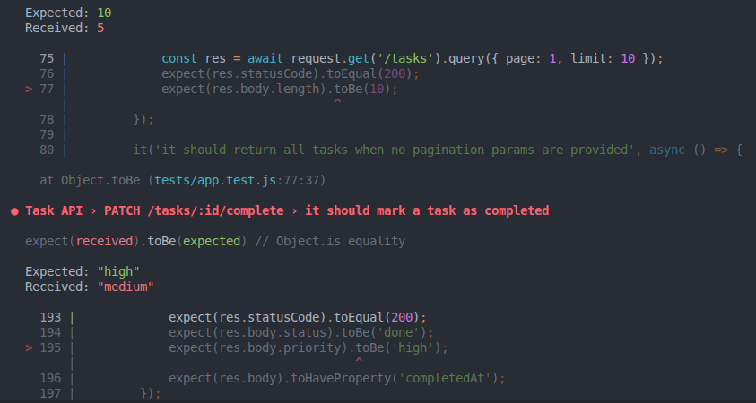

# Bug Report - Task API

## Scope
This report summarizes the bugs found while running integration tests against the API and the fixes applied.

Test run command:

```bash
cd task-api
npm test 
```

Current result after fixes: 35 passing, 0 failing.



Note: The screenshot above was taken before applying fixes, when the related tests were failing.

Validation notes:
- Pagination tests now pass with 1-based page numbers.
- Completing a task now preserves its existing priority.
- `PATCH /tasks/:id/assign` now returns `409` when the task is already assigned.
- Unit tests were added for service logic, alongside integration tests for routes.

---

## 1) Pagination Returns Wrong Slice
- Location:
  - `task-api/src/services/taskService.js` (`getPaginated`)
- Expected behavior:
  - For 1-based page numbers, `page=1&limit=10` should return the first 10 tasks.
- Actual behavior:
  - `page=1&limit=10` returned the wrong slice and skipped the first 10 tasks.
- How discovered:
  - Failing test: `GET /tasks -> it should paginate tasks` in `task-api/tests/app.test.js`.
- Why it happens:
  - Offset is calculated as `page * limit` instead of `(page - 1) * limit`.
- Fix idea:
  - Change offset to `(page - 1) * limit`.

---

## 2) Completing Task Mutates Priority
- Location:
  - `task-api/src/services/taskService.js` (`completeTask`)
- Expected behavior:
  - Completing a task should set `status` to `done` and set `completedAt`, while preserving existing `priority`.
- Actual behavior:
  - Priority is forcibly changed to `medium` during completion.
- How discovered:
  - Failing test: `PATCH /tasks/:id/complete -> it should mark a task as completed` in `task-api/tests/app.test.js`.
- Why it happens:
  - `completeTask` hardcodes `priority: 'medium'` in the updated object.
- Fix idea:
  - Remove the priority override from `completeTask`.

---

## Additional Notes
- `PATCH /tasks/:id/assign` endpoint exists and basic validation appears correct for:
  - success path,
  - 400 for invalid/empty assignee,
  - 404 for missing task.
- The bugs listed above were verified by tests and then fixed.
- Final test split:
  - integration tests: `tests/app.test.js`
  - unit tests: `tests/taskService.test.js`
