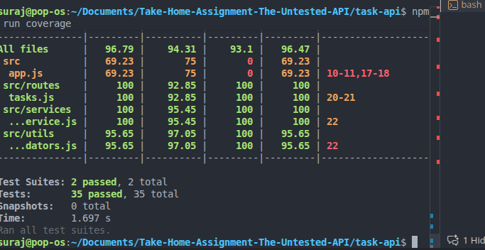

# Submission Note

## Final Test Status
- Test suites: 2 passed (integration + unit)
- Tests: 35 passed, 0 failed
- Coverage run completed successfully (`npm run coverage`)

## What I would test next
- Query parameter edge cases for pagination (`page=0`, negative numbers, non-numeric values, very large limits).
- `GET /tasks?status=` behavior for invalid statuses (decide whether to return empty list or `400`).
- Assignment edge cases:
  - whitespace trimming behavior,
  - attempting to assign completed tasks,
  - policy for unassign/reassign flows.

## What surprised me
- Several bugs were easy to uncover with straightforward integration tests (pagination offset and priority mutation on complete), which suggests test coverage was the main missing safeguard.

## Questions before shipping to production
- Should reassignment always be blocked (409), or should we support explicit reassignment with audit/history?
- What is the intended API behavior for invalid filter values (for example, unknown `status`)?
- Should completion be idempotent and return the same payload for already completed tasks?
- Should pagination defaults always apply when no query params are passed, or only when `page`/`limit` are present?
- Do we need stronger input constraints for assignee names (length limits, allowed characters)?
